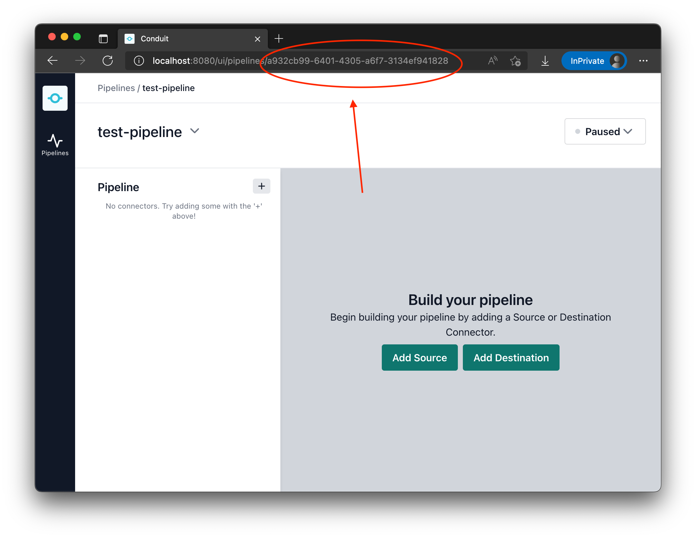

# Conduit Redis Connector

This is a proof of concept in building a connector for conduit. This a source connector that will subscribe to a single channel in Redis. Once the payload is in Conduit, you can send the data anywhere you need to in your infrastructure.

## Getting Started

### Prerequsites

- Conduit is install on your machine. See the Conduit instructions for getting started.
- Redis is installed. See Redis instructions. If you're on a mac, it's as easy as doing `brew install redis`.

### Steps

Let's assume we have Conduit installed your home path (e.g. `~/`)

1. Clone this repo
2. Run `make`. This will produce a binary called `conduit-redis-connector`.
3. Start Conduit (example: `./conduit`)
    ```
    $ ~/conduit
    ```

4. Start Redis
    ```
    $ redis-server
    ```

4. Create a pipeline in Conduit. You can use the UI to do this. Once you've done it, you can grab the pipeline UUID from the URL
   

5. For this part, we'll need to set up this redis connector via the API. Here's an example payload using curl to post to the API. You'll notice in the settings section, you'll need to set the channel that you want the connector to listen to:
   ```
   $ curl --header "Content-Type: application/json" \
       --request POST \
       --data '{
                 "type": "TYPE_SOURCE",
                 "plugin": "~/conduit-connector-redis",
                 "pipeline_id": "a932cb99-6401-4305-a6f7-3134ef941828",
                 "config": {
                   "name": "actioncable-redis-source",
                   "settings": {
                     "channel": "production-chatroom",
                     "uri": "redis://localhost:6379/"
                   }
                 }
               }'
        -g http://localhost:8080/v1/connectors

   ```
   _Note:_ At the time I wrote this, Conduit can only set up connectors that you create via the API. This limitation should be fixed by Conduit 0.3.

6. There you go! Now Conduit is pulling in messages from a channel and you can send that any where you want. I was using this connector to save off all of the chat history in a Rails app that was using [ActionCable](https://guides.rubyonrails.org/action_cable_overview.html). Since Conduit can be orchestrated, I set up and tore down these pipelines via the code in the Rails app as well!

